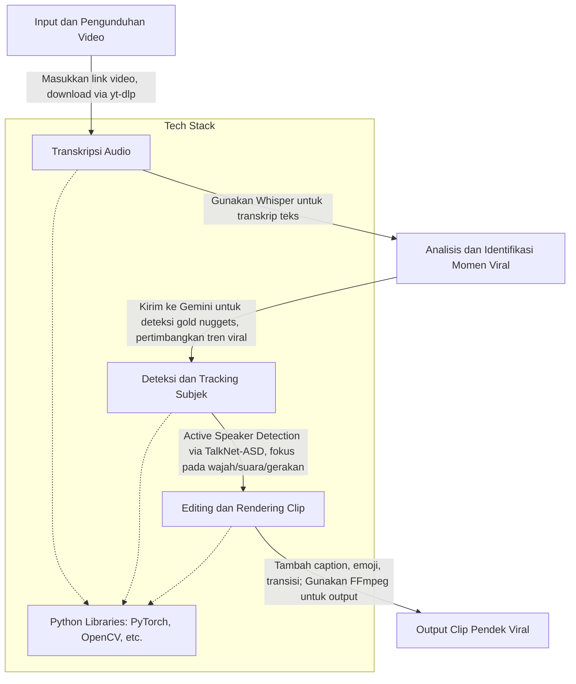
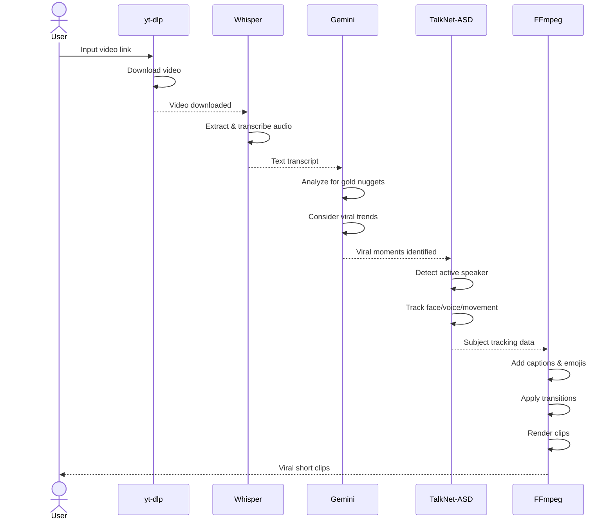

# Mermaid diagram for my reference

```mermaid
graph TD
    A[Input dan Pengunduhan Video] -->|Masukkan link video, download via yt-dlp| B[Transkripsi Audio]
    B[Transkripsi Audio] -->|Gunakan Whisper untuk transkrip teks| C[Analisis dan Identifikasi Momen Viral]
    C[Analisis dan Identifikasi Momen Viral] -->|Kirim ke Gemini untuk deteksi gold nuggets, pertimbangkan tren viral| D[Deteksi dan Tracking Subjek]
    D[Deteksi dan Tracking Subjek] -->|Active Speaker Detection via TalkNet-ASD, fokus pada wajah/suara/gerakan| E[Editing dan Rendering Clip]
    E[Editing dan Rendering Clip] -->|Tambah caption, emoji, transisi; Gunakan FFmpeg untuk output| F[Output Clip Pendek Viral]
    subgraph Tech Stack
        G[Python Libraries: PyTorch, OpenCV, etc.]
        B -.-> G
        D -.-> G
        E -.-> G
    end
```

```mermaid
sequenceDiagram
    actor User
    participant YtDlp as yt-dlp
    participant Whisper
    participant Gemini
    participant TalkNet as TalkNet-ASD
    participant FFmpeg
    
    User->>YtDlp: Input video link
    YtDlp->>YtDlp: Download video
    YtDlp-->>Whisper: Video downloaded
    
    Whisper->>Whisper: Extract & transcribe audio
    Whisper-->>Gemini: Text transcript
    
    Gemini->>Gemini: Analyze for gold nuggets
    Gemini->>Gemini: Consider viral trends
    Gemini-->>TalkNet: Viral moments identified
    
    TalkNet->>TalkNet: Detect active speaker
    TalkNet->>TalkNet: Track face/voice/movement
    TalkNet-->>FFmpeg: Subject tracking data
    
    FFmpeg->>FFmpeg: Add captions & emojis
    FFmpeg->>FFmpeg: Apply transitions
    FFmpeg->>FFmpeg: Render clips
    FFmpeg-->>User: Viral short clips
```
