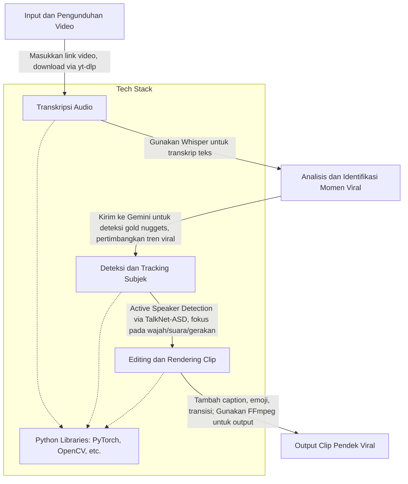
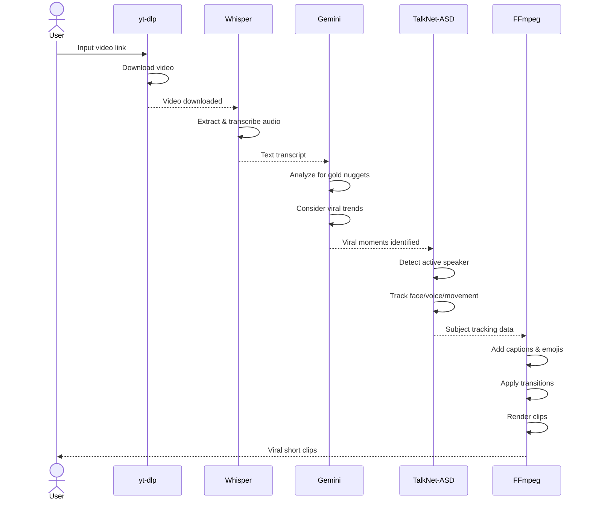

# Minimal video repurposing implementation





## Table of Contents

- [Development Environment Setup](#development-environment-setup)
  - [For Nix Users](#for-nix-users)
  - [For Non-Nix Users](#for-non-nix-users)
- [TODOS](#todos)

## Development Environment Setup

This project requires Python 3.13, Rust, and various tools for video processing. Setup instructions are provided for both Nix and non-Nix users.

### For Nix Users

1. Install [devenv](https://devenv.sh/getting-started/):
   ```bash
   nix-env -iA devenv -f https://github.com/cachix/devenv/tarball/main
   ```

2. Enter the development shell:
   ```bash
   devenv shell
   ```

3. Install Python dependencies:
   ```bash
   uv sync
   ```

4. Build the Rust server:
   ```bash
   cargo build
   ```

### For Non-Nix Users

1. Install Python 3.13 (using pyenv or your preferred method):
   ```bash
   pyenv install 3.13
   pyenv local 3.13
   ```

2. Install [uv](https://github.com/astral-sh/uv):
   ```bash
   curl -LsSf https://astral.sh/uv/install.sh | sh
   ```

3. Install Python dependencies:
   ```bash
   uv sync
   ```

4. Install Rust (using rustup):
   ```bash
   curl --proto '=https' --tlsv1.2 -sSf https://sh.rustup.rs | sh
   source $HOME/.cargo/env
   ```

5. Install Node.js (latest LTS):
   - On macOS: `brew install node`
   - On Ubuntu: `sudo apt install nodejs npm`
   - On Windows: Download from [nodejs.org](https://nodejs.org/)

6. Install ffmpeg:
   - On macOS: `brew install ffmpeg`
   - On Ubuntu: `sudo apt install ffmpeg`
   - On Windows: Download from [ffmpeg.org](https://ffmpeg.org/download.html)

7. Build the Rust server:
   ```bash
   cargo build
   ```

### TODOS:

- [x] Handle user inputs. For now identified inputs are YouTube Video URL, selected categories, and User Prompt.
- [x] YouTube Downloader (using yt-dlp)
- [x] Audio transcription, given the extracted audio from the downloaded video (ffmpeg & openai/whisper involved).
- [x] Moments / gold-nuggets identification & analysis. For now just raw-dog to Google's Gemini AI begging for trend, viral, moment identification.
- [ ] Object, subject, and active-speaker detection (TalkNet-ASD) focusing on face, voice, and movement.
- [ ] Editing & Rendering Clips (oh shi, ffmpeg again...). For captions, emoji, filters, and transitions.
